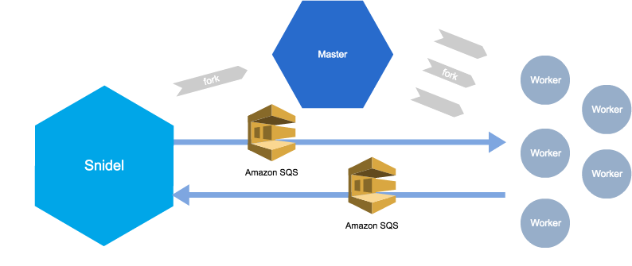

# Snidel Amazon SQS plugin



## Install

#### composer.json

```json
{
    "require": {
    	"ackintosh/snidel": "*",
    	"ackintosh/snidel-queue-sqs": "*"
    }
}
```

## Usage

```php

$snidel = new Snidel(array(
    'aws-key'     => 'YOUR AWS KEY',
    'aws-secret'  => 'YOUR AWS SECRET',
    'aws-region'  => 'YOUR AWS REGION',
    'concurrency' => 2,
    'taskQueue'   => array(
        'className' => '\Ackintosh\Snidel\Queue\Sqs\Task',
    ),
    'resultQueue' => array(
        'className' => '\Ackintosh\Snidel\Queue\Sqs\Result',
    ),
));

$snidel->fork(function () {
    return 'hello, snidel-queue-sqs!';
});

$snidel->get()->toArray();
```